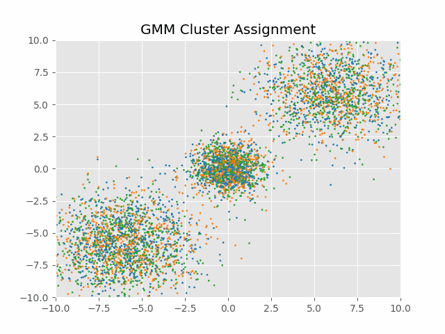

# Gibbs-Langevin Sampler

This project is a code implementation of a Gibbs sampler for mixed support distributions,  where th component samplers are Langevin samplers. The sampler is demonstrated on a simple Gaussian Mixture Model (GMM) parameter inference. For the continuous parameters. For the continuous variables, we use the [Stochastic Gradient Hamiltonian Monte Carlo](http://arxiv.org/abs/1402.4102) (SGHMC) and for the discrete variables, the [Discrete Metropolis Adjusted Langevin](http://arxiv.org/abs/2206.09914) sampler (DMALA) is used.

Although the sampler is demonstrated on a simple GMM, it can be easily extended to more complex models such as spike and slab models for variable selection.

